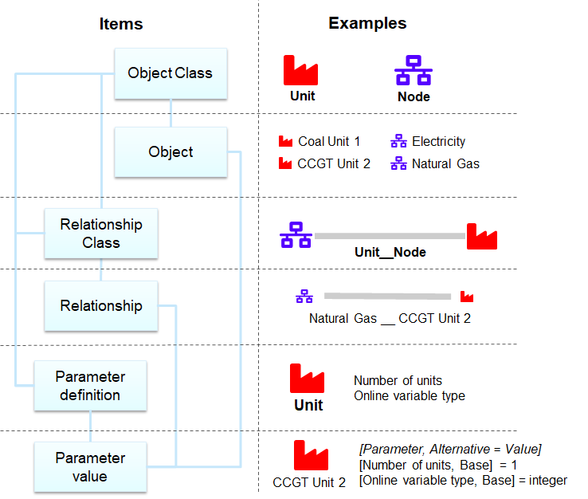

********************
Spine data structure
********************

.. contents::
   :local:

Main features
--------------------

Spine data structure follows entity-attribute-value (EAV) with classes and relationships data model 
(`Wikipedia <https://en.wikipedia.org/wiki/Entity%E2%80%93attribute%E2%80%93value_model#EAV/CR:_representing_substructure_with_classes_and_relationships>`_).
It is an open schema where the data structure is defined through data (and not through database structure). 
Spine Toolbox also adds an ability to hold alternative parameter values for the same parameter of a particular entity. 
This allows the creation of scenarios.
A potential weakness of EAV is that each parameter value needs a separate row in the database which could make the parameter table large and slow. 
In Spine Toolbox this is circumvented by allowing different datatypes like time series and maps to be represented in the parameter field 
and thus greatly reducing the number of rows required to present large systems.

Definitions
===========

1. Entity: an object (one dimension) or a relationship (n-dimensions)
2. Attribute: parameter name
3. Value: parameter value
4. Entity class: a category for entities (e.g. 'unit' is an object class while 'coal_power_plant' is an entity of 'unit' class)
5. Alternative: Each parameter value belongs to one alternative
6. Scenario: Combines alternatives into a single scenario

Diagram
=======

