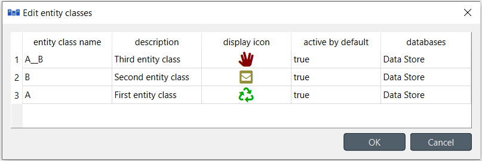

Updating data
-------------

This section describes the available tools to update existing data.

.. contents::
   :local:

Updating entities and classes
=============================

From **Entity Tree** or **Graph View**
~~~~~~~~~~~~~~~~~~~~~~~~~~~~~~~~~~~~~~

Select any number of entity and/or class items in **Entity Tree**, or any number of entity items in **Graph View**.
Then, right-click on the selection and choose **Edit...** from the context menu.

Depending on the selections, at least one *Edit...* dialog will pop up,
and the tables will be filled with the current data of selected items. E.g.:

Modify the field(s) you want under the corresponding column(s).
Specify the databases where you want to update each item under the *databases* column.
When you're ready, press **OK**.

From **Pivot View**
~~~~~~~~~~~~~~~~~~~

To rename an entity of a specific class, bring the class to **Pivot View** using any input type
(see :ref:`using_pivot_table_and_frozen_table`).
Then, just edit the appropriate cell in the corresponding class header.

Updating parameter definitions and values
=========================================

From **Table Views**
~~~~~~~~~~~~~~~~~~~~~

To update parameter data, just go to the appropriate **Table View** and edit the corresponding row.

From **Pivot View**
~~~~~~~~~~~~~~~~~~~

To rename parameter definitions for a class,
bring the corresponding class to **Pivot View** using the **Value** input type
(see :ref:`using_pivot_table_and_frozen_table`).
Then, just edit the appropriate cell in the **parameter** header.

To modify parameter values for an entity,
bring the corresponding class to **Pivot View** using the **Value** input type
(see :ref:`using_pivot_table_and_frozen_table`).
Then, just edit the appropriate cell in the table body.

Updating entity alternatives
============================

To update an entity alternative, edit the corresponding row from **Entity Alternative** in **Table View**.

Updating alternatives
=====================

From **Pivot View**
~~~~~~~~~~~~~~~~~~~

Select the **Scenario** input type (see :ref:`using_pivot_table_and_frozen_table`).
To rename an alternative, just edit the proper cell in the **alternative** header.

From **Alternative**
~~~~~~~~~~~~~~~~~~~~

To rename an alternative, just edit the appropriate item in **Alternative**.

Updating scenarios
==================

From **Pivot View**
~~~~~~~~~~~~~~~~~~~

Select the **Scenario** input type (see :ref:`using_pivot_table_and_frozen_table`).
To rename a scenario, just edit the proper cell in the **scenario** header.

To change the alternatives of a scenario as well as their ranks,
check or uncheck the boxes on the pivot table.
The number in the checkbox signifies the alternative's rank.

From **Scenario Tree**
~~~~~~~~~~~~~~~~~~~~~~

To rename a scenario, just edit the appropriate item in **Scenario Tree**.

To change scenario alternative ranks, just drag and drop the items under the corresponding scenario.

Updating parameter value lists
==============================

To rename a parameter value list or change any of its values, just edit
the appropriate item in **Parameter value list**.
