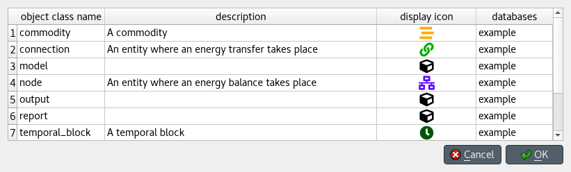

Updating data
-------------

This section describes the available tools to update existing data.

.. contents::
   :local:

Updating entities and classes
=============================

From *Object tree*, *Relationship tree*, or *Entity graph*
~~~~~~~~~~~~~~~~~~~~~~~~~~~~~~~~~~~~~~~~~~~~~~~~~~~~~~~~~~

Select any number of entity and/or class items in *Object tree*
or *Relationship tree*, or any number of object and/or relationship items in *Entity graph*.
Then, right-click on the selection and choose **Edit...** from the context menu.

One separate *Edit...* dialog will pop up for each selected entity or class type,
and the tables will be filled with the current data of selected items. E.g.:

Modify the field(s) you want under the corresponding column(s).
Specify the databases where you want to update each item under the *databases* column.
When you're ready, press **Ok**.

From *Pivot table*
~~~~~~~~~~~~~~~~~~

To rename an object of a specific class, bring the class to *Pivot table* using any input type
(see :ref:`using_pivot_table_and_frozen_table`).
Then, just edit the appropriate cell in the corresponding class header.

Updating parameter definitions and values
=========================================

From *Stacked tables*
~~~~~~~~~~~~~~~~~~~~~

To update parameter data, just go to the appropriate *Stacked table* and edit the corresponding row.

From *Pivot table*
~~~~~~~~~~~~~~~~~~

To rename parameter definitions for a class,
bring the corresponding class to *Pivot table* using the **Parameter value** input type
(see :ref:`using_pivot_table_and_frozen_table`).
Then, just edit the appropriate cell in the **parameter** header.

To modify parameter values for an object or relationship,
bring the corresponding class to *Pivot table* using the **Parameter value** input type
(see :ref:`using_pivot_table_and_frozen_table`).
Then, just edit the appropriate cell in the table body.

Updating alternatives
=====================

From *Pivot table*
~~~~~~~~~~~~~~~~~~

Select the **Scenario** input type (see :ref:`using_pivot_table_and_frozen_table`).
To rename an alternative, just edit the proper cell in the **alternative** header.

From *Alternative tree*
~~~~~~~~~~~~~~~~~~~~~~~

To rename an alternative, just edit the appropriate item in *Alternative tree*.

Updating scenarios
==================

From *Pivot table*
~~~~~~~~~~~~~~~~~~

Select the **Scenario** input type (see :ref:`using_pivot_table_and_frozen_table`).
To rename a scenario, just edit the proper cell in the **scenario** header.

To change the alternatives of a scenario as well as their ranks,
check or uncheck the boxes on the pivot table.
The number in the checkbox signifies the alternative's rank.

From *Scenario tree*
~~~~~~~~~~~~~~~~~~~~

To rename a scenario, just edit the appropriate item in *Scenario tree*.

To change scenario alternative ranks, just drag and drop the items under the corresponding scenario.

Updating tools and features
===========================

To change a feature or method, or rename a tool, just edit the appropriate item in *Tool/Feature tree*.

Updating parameter value lists
==============================

To rename a parameter value list or change any of its values, just edit the appropriate item in *Parameter value list*.
