Viewing data
------------

This section describes the available tools to view data.

.. contents::
   :local:

Viewing entities and entity classes
===================================

Using the **Entity Tree**
~~~~~~~~~~~~~~~~~~~~~~~~~

The **Entity Tree** presents the structure of entity classes and entities in all databases in the shape of a tree:

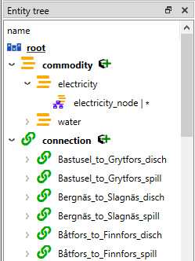

- To view all entity classes from all databases,
  expand the root item (automatically expanded when loading the form).
- To view all entities of a class, expand the corresponding entity class item.
- To view all multidimensional entities where a specific entity is an member, expand that entity.

.. tip:: To *extend* the selection in **Entity Tree**, press and hold the **Ctrl** key
   while clicking on the items.

Right clicking items in the **Entity Tree** will open up a context menu. Depending on what kind of item
the menu was opened from (root, entity class, entity, N-D entity) all of the options might not be available.
Unavailable options are still visible but they are greyed out:

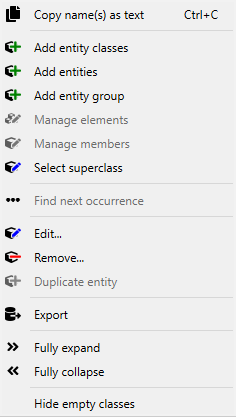

- **Copy name(s) as text** copies the data from the selection so that it can be pasted elsewhere.

- **Add entity classes** opens up a dialog to add new entity classes.
- **Add entities** opens up a dialog to add new entities.
- **Add entity group** opens up a dialog to create entity groups.
- **Manage elements** opens up a dialog where new entities can be created or existing ones deleted for
  a multidimensional entity.
- **Manage members** opens up a dialog to delete or add new members in an entity group.
- **Select superclass** opens up a dialog to set the superclass for a given entity class

- **Find next occurrence** goes to the next occurrence of the N-D entity in the **Entity Tree** and selects it.
  This can also be done by double-clicking the item.

- **Edit...** opens up a dialog where the name, description, icon and active by default -setting of an
  entity can be changed.
- **Remove...** removes the selection.
- **Duplicate entity** duplicates the whole entity.

- **Export** creates a new Spine Database in an `.sqlite` file with all of the relevant data to the selection.

- **Fully expand** expands the selection and all its children.
- **Fully collapse** collapses the selection and all its children.

- **Hide empty classes** whether to show empty classes in the tree or not.

.. tip:: To expand an item in **Entity Tree**, you can also double-click on the item or press the right arrow.
   This will only expand the next layer and leave the children expanded or collapsed depending on their previous
   state. Items in gray don't have any children, thus they cannot be expanded. To collapse an expanded item,
   double-click on it again or press the left arrow.

.. tip:: **Entity Tree** also supports **Sticky selection**, which allows one to
   extend the selection by clicking on items *without pressing* **Ctrl**. To enable **Sticky selection**, select
   **Settings** from the hamburger menu, and check the corresponding box.

Using the **Graph View**
~~~~~~~~~~~~~~~~~~~~~~~~

**Graph View** presents the structure of entities from one database in the shape of a graph:

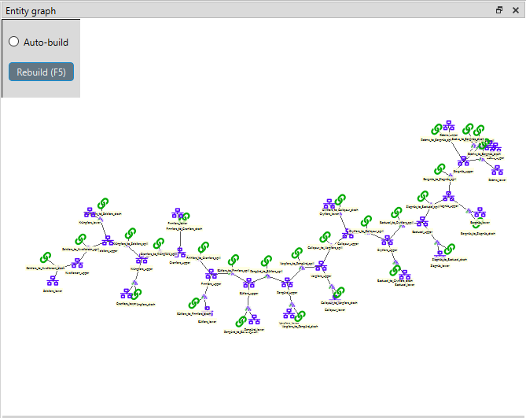

Building the graph
******************

To build the graph, select any number of items in the **Entity Tree**.
What is included in the graph depends on the specific selection you make in the **Entity Tree**:

- To include all entities from the database, select the root item.
- To include all entities of an entity class, select the corresponding class item.
- To include specific entities, select them by holding down **Ctrl**.

.. note:: In **Graph View**, a small unnamed vertex represents a multidimensional entity with multiple elements,
   whereas a bigger named vertex represents a zero dimensional entity. An arc between entities indicates that
   the 0-D entity is an element of that N-D entity.

The graph automatically includes N-D entities whenever *all* the elements of that entity are included
(even if these entities are not selected in **Entity Tree**). You can change this behavior to automatically
include N-D entities whenever *any* of the member elements are included. To do this, enable **Auto-expand entities**
via the **Graph View**'s context menu.

Manipulating the graph
**********************

You can move items in the graph by dragging them with your mouse. By default, each items moves individually.
Like in the **Design view**, multiple items can be moved at once by selecting them first.

To display **Graph View**'s context menu, just right-click on an empty space in the graph.
The context menu has the following options:

- **Add entities...** opens up the add entities dialog, from where new entities can be added.

- **Search** highlights the specified entities with color so that they are easier to visualize.

- **Hide classes** can be used to disable all of the entities from an entity class from showing in the graph.
  **Show** can then be used to bring back the hidden classes one by one or **Show all** to bring them all back.

- **Prune classes** works like **Hide classes** but it also hides all the classes that have the specified class
  as an element. Once again these can be brought back one by one with **Restore** or all at once with **Restore all**.

- **Zoom** has three options: zoom out, zoom in and reset zoom. Using the scroll wheel of the mouse on the **Graph View**
  also works.
- **Arc-length** has two buttons: one for making the arcs between the entities longer and one for making them shorter.
- **Rotate** rotates the whole graph by 15° per step. Also can be done by holding down **SHIFT** while scrolling with
  the mouse wheel.

- **Auto-expand entities** If enabled, the graph will also include entities where the selections are members besides
  just the selections. if disabled, the graph will only show the selected entities.
- **Merge databases** Whether to merge the databases or not.
- **Snap entities to grid** makes it so that the placement of the entities can't be arbitrary anymore but
  instead they can only lay on a grid.
- **Max. entity dimension count** defines a cutoff for the number of dimensions an entity can have and still be drawn.
- **Number of build iterations** defines the maximum numbers of iterations the layout generation algorithm can make.
- **Minimum distance between nodes (%)** is used for setting the ideal distance between entities in the graph.
- **Decay rate of attraction with distance** The higher this number, the lesser the attraction between distant
  vertices when drawing the graph.

- **Select graph parameters** is where different aspects of the graph can be mapped to for example parameter values.
- **Select background image** can be used to set any `.svg` image as the background for the graph.

- **Save positions** Saves the positions of the items into the database. To clear the saved position select
  **Clear saved positions**.

- **Save state...** saves the drawn graph. Selecting a specific state from **Load state...** will load that state
  into the **Graph View**. Saved states can be deleted from **Remove state**.

- **Export as image...** can be used to export the image of the graph in either `.svg` or `.pdf` formats
- **Export as video...** can be used to export the video of the graph.

- **Rebuild** to rebuild the whole graph.

.. note:: **Graph View** supports extended selection and rubber-band selection.
   To extend a selection, press and hold **Ctrl** while clicking on the items.
   To perform rubber-band selection, drag your mouse around the items you want to select.

.. note:: Pruned items are remembered across graph builds.

To display an entity item's context menu, just right-click on it. The context menu has a few different options:

- To expand or collapse N-D entities, on an entities context menu hover **Expand** or **Collapse** and select
  the entity class from the popup menu.
- **Connect entities** allows the creation of new N-D entities straight from the **Graph View**. When hovering over
  the option, the list of relevant multi dimensional entity classes where the selected entity could possibly be
  a member are shown. After selecting one of the items in the list, the entities that you want to make up the new
  new entity in the selected entity class can be selected by clicking them in the graph. Once the selections are
  made, a popup showing the to be added entities is shown. By default every permutation of the selections is staged
  to be added but individual items can be also deselected.
- **Edit**, **Remove** and **Duplicate** work as they do in the **Entity Tree**.

Viewing parameter definitions and values as well as entity alternatives
=======================================================================

Using **Table Views**
~~~~~~~~~~~~~~~~~~~~~

**Table View**'s: *Parameter value*, *Parameter definition* and *Entity alternative* present entity data
from all databases in the form of tables:

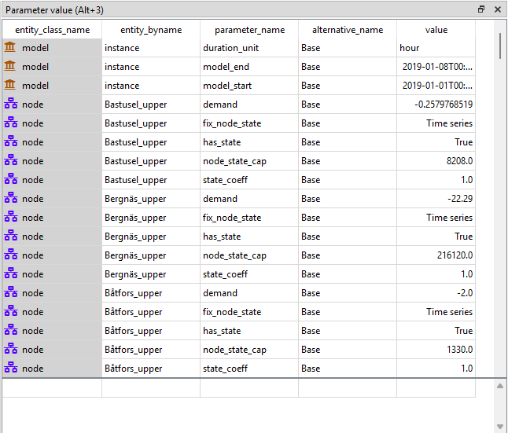

To filter a **Table View** by any entities and/or classes,
select the corresponding items in either **Entity Tree** or **Graph View**.
To remove all these filters, select the root item in **Entity Tree**.

A **Table View** can also be filtered by selecting alternatives or scenarios from **Alternative**
and **Scenario tree**. This filter is orthogonal to the entity/class filter and can be used together with it.
To remove all these filters, simply select the root item in **Entity Tree** or deselect all items from
**Alternative** and **Scenario tree**.

All the filters described above can be cleared with the *Clear all filters* item available in the right-click
context menu of the **Table View**.

To apply a custom filter on a **Table View**, click on any horizontal header.
A menu will pop up listing the items in the corresponding column:

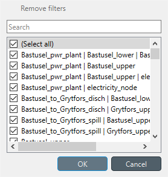

Uncheck the items you don't want to see in the table and press **Ok**.
Additionally, you can type in the search bar at the top of the menu to filter the list of items.
To remove the current filter, select **Remove filters**.

To filter a **Table View** according to a selection of items in the table itself, right-click on the selection
to show the context menu, and then select **Filter by** or **Filter excluding**. To remove these filters, select
**Remove filters** from the header menus of the filtered columns.

.. tip:: You can rearrange columns in *Table Views* by dragging the headers with your mouse.
   The ordering will be remembered the next time you open Spine DB editor.

**Entity alternative**
~~~~~~~~~~~~~~~~~~~~~~

Entity alternative provides a way to set which entities are active and which are not in each alternative:

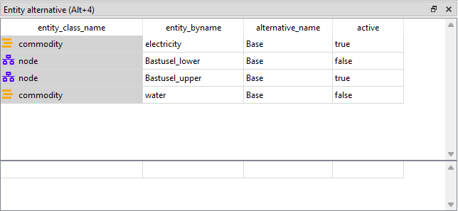

Viewing parameter values and multidimensional entities
======================================================

.. _using_pivot_table_and_frozen_table:

Using **Pivot View** and **Frozen Table**
~~~~~~~~~~~~~~~~~~~~~~~~~~~~~~~~~~~~~~~~~

**Pivot View** and **Frozen Table** present data for an individual class from one database in the form of a pivot table,
optionally with frozen dimensions:

.. image:: img/pivot_table.png
   :align: center

To populate the tables with data for a certain class,
just select the corresponding class item in **Entity Tree**.

Selecting the input type
************************

**Pivot View** and **Frozen Table** support four different input types:

- **Value** (the default): it shows entities, parameter definitions, alternatives, and databases in the headers,
  and corresponding parameter values in the table body.
- **Index**: Similar to the above, but it also shows parameter indexes in the headers.
  Indexes are extracted from special parameter values, such as time-series.
- **Element**: it shows entities, and databases in the headers, and corresponding multidimensional entities
  in the table body. It only works when a N-D entity is selected in the **Entity Tree**.
- **Scenario**: it shows scenarios, alternatives, and databases in the header, and corresponding *rank*
  in the table body.

You can select the input type from the **Pivot** section in the hamburger menu.

.. note:: In **Pivot View**, header blocks in the top-left area indicate what is shown in each horizontal
   and vertical header. For example, in **Value** input type, by default, the horizontal header
   has two rows, listing alternative and parameter names, respectively; whereas the vertical header has
   one or more columns listing entity names.

Pivoting and freezing
*********************

To pivot the data, drag a header block across the top-left area of the table.
You can turn a horizontal header into a vertical header and vice versa,
as well as rearrange headers vertically or horizontally.

To freeze a dimension, drag the corresponding header block from **Pivot View** into **Frozen table**.
To unfreeze a frozen dimension, just do the opposite.

.. note:: Your pivoting and freezing selections for any class will be remembered when switching to another class.

.. tip:: If you are not seeing the data you think you should be seeing, it might be because there is
         some selection active in the **Frozen Table** that is filtering those values out of the **Pivot View**.

Filtering
*********

To apply a custom filter on **Pivot View**, click on the arrow next to the name of any header block.
A menu will pop up listing the items in the corresponding row or column:

Uncheck the items you don't want to see in the table and press **Ok**.
Additionally, you can type in the search bar at the top of the menu to filter the list of items.
To remove the current filter, select **Remove filters**.

To filter the **Pivot View** by an individual vector across the frozen dimensions,
select the corresponding row in **Frozen Table**.

Viewing alternatives and scenarios
==================================

You can find alternatives from all databases under **Alternative**:

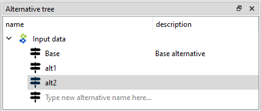

To view the alternatives from each database,
expand the root item for that database.

Viewing scenarios
=================

You can find scenarios from all databases under **Scenario tree**:

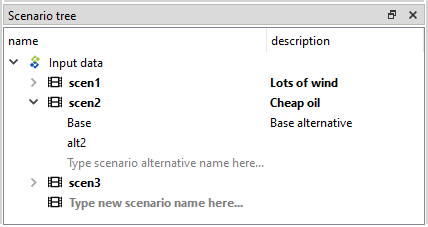

To view the scenarios from each database,
expand the root item for that database.
To view the alternatives for a particular scenario,
expand the corresponding scenario item.

Viewing parameter value lists
=============================

You can find parameter value lists from all databases under **Parameter value list**:

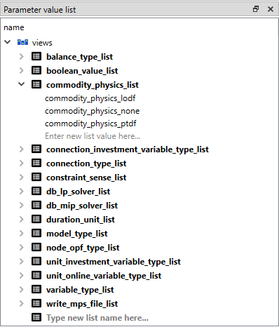

To view the parameter value lists from each database, 
expand the root item for that database.
To view the values for each list, expand the corresponding list item.

Viewing metadata
================

You can find metadata from all databases under **Metadata**:

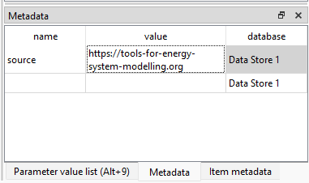

See also :ref:`Metadata description`.

Viewing item metadata
=====================

You can find metadata for currently selected entities or parameter values under **Item metadata**:

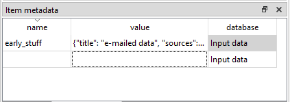
