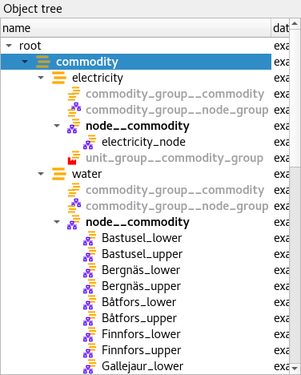
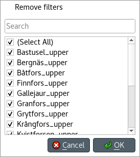
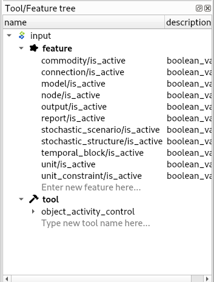

Viewing data
------------

This section describes the available tools to view data.

.. contents::
   :local:

Viewing entities and classes
============================

Using *Entity trees*
~~~~~~~~~~~~~~~~~~~~

*Entity trees* present the structure of classes and entities in all databases in the shape of a tree:

In *Object tree*:

- To view all object classes from all databases,
  expand the root item (automatically expanded when loading the form).
- To view all objects of a class, expand the corresponding object class item.
- To view all relationship classes involving an object class, expand any objects of that class.
- To view all relationships of a class involving a given object,
  expand the corresponding relationship class item under the corresponding object item.

In *Relationship tree*:

- To view all relationship classes from all databases, 
  expand the root item (automatically expanded when loading the form).
- To view all relationships of a class, 
  expand the corresponding relationship class item.

.. note:: To expand an item in *Object tree* or *Relationship tree*, 
   double-click on the item or press the right arrow while it's active.
   Items in gray don't have any children, thus they cannot be expanded.
   To collapse an expanded item, double-click on it again or press the left arrow while it's active.

.. tip:: To expand or collapse an item and all its descendants in *Object tree* or *Relationship tree*,
   right click on the item to display the context menu, and select **Fully expand** or **Fully collapse.**

.. tip:: In *Object tree*, the same relationship appears in many places (as many as it has dimensions). 
   To jump to the next occurrence of a relationship item, either double-click on the item,
   or right-click on it to display the context menu, and select **Find next**.

Using *Entity graph*
~~~~~~~~~~~~~~~~~~~~

*Entity graph* presents the structure of classes and entities from one database in the shape of a graph:

.. image:: img/entity_graph.png
   :align: center

.. tip:: To see it in action, check out `this video <https://youtu.be/pSdl9fogNaE>`_.

Building the graph
******************

To build the graph, select any number of items in either *Object tree* or *Relationship tree*.
What is included in the graph depends on the specific selection you make:

- To include all objects and relationships from the database,
  select the root item in either *Object tree* or *Relationship tree*.
- To include all objects of a class, select the corresponding class item in *Object tree*.
- To include all relationships of a class, select the corresponding class item in *Relationship tree*.
- To include all relationships of a specific class involving a specific object,
  select the corresponding relationship class item under the corresponding object item in *Object tree*.
- To include specific objects or relationships,
  select the corresponding item in either *Object tree* or *Relationship tree*.

.. note:: In *Entity graph*, a small unnamed vertex represents a relationship,
   whereas a bigger named vertex represents an object. An arc between a relationship and an object
   indicates that the object is a member in that relationship.

The graph automatically includes relationships whenever *all* the member objects are included
(even if these relationships are not selected in *Object tree* or *Relationship tree*).
You can change this behavior to automatically include relationships
whenever *any* of the member objects are included.
To do this, enable **Auto-expand objects** via the **Graph** menu,
or via *Entity graph*'s context menu.

.. tip:: To *extend* the selection in *Object tree* or *Relationship tree*, press and hold the **Ctrl** key
   while clicking on the items.

.. tip:: *Object tree* and *Relationship tree* also support **Sticky selection**, which allows one to 
   extend the selection by clicking on items *without pressing Ctrl*.
   To enable **Sticky selection**, select **Settings** from the hamburger menu, and check the corresponding box.

Manipulating the graph
**********************

You can move items in the graph by dragging them with your mouse.
By default, each items moves individually.
To make relationship items move along with their member objects,
select **Settings** from the hamburger menu and check the box next to
*Move relationships along with objects in Entity graph*.

To display *Entity graph*'s context menu, just right-click on an empty space in the graph.

- To save the position of items into the database,
  select the items in the graph and choose **Save positions** from the context menu.
  To clear saved positions, select the items again and choose **Clear saved positions** from the context menu.
- To hide part of the graph, select the items you want to hide and choose **Hide**  from context menu.
  To show the hidden items again, select **Show hidden** from the context menu.
- To prune the graph, select the items you want to prune and then choose **Prune entities**
  or **Prune classes** from the context menu.
  To restore specific pruned items, display the context menu,
  hover **Restore** and select the items you want to restore from the popup menu.
  To restore all pruned items at once, select **Restore all** from the context menu.
- To zoom in and out, scroll your mouse wheel over *Entity graph* or use **Zoom** buttons 
  in the context menu.
- To rotate clockwise or anti-clockwise, press and hold the **Shift** key while scrolling your mouse wheel,
  or use the **Rotate** buttons in the context menu.
- To adjust the arcs' length, use the **Arc length** buttons in the context menu.
- To rebuild the graph after moving items around, select **Rebuild graph** from the context menu.
- To export the current graph as a PDF file, select **Export graph as PDF** from the context menu.

.. note:: *Entity graph* supports extended selection and rubber-band selection.
   To extend a selection, press and hold **Ctrl** while clicking on the items.
   To perform rubber-band selection, press and hold **Ctrl** while dragging your mouse
   around the items you want to select.

.. note:: Pruned items are remembered across graph builds.

To display an object or relationship item's context menu, just right-click on it.

- To expand or collapse relationships for an object item, hover **Expand** or **Collapse** and select the relationship
  class from the popup menu.

Viewing parameter definitions and values
========================================

Using *Stacked tables*
~~~~~~~~~~~~~~~~~~~~~~

*Stacked tables* present object and relationship parameter data from all databases in the form of stacked tables:

.. image:: img/object_parameter_value_table.png
   :align: center

To filter *Stacked tables* by any entities and/or classes,
select the corresponding items in either *Object tree*, *Relationship tree*, or *Entity graph*.
To remove all these filters, select the root item in either *Object tree* or *Relationship tree*.

*Stacked tables* can also be filtered by selecting alternatives or scenarios from *Alternative tree*
and *Scenario tree*. This filter is orthogonal to the entity/class filter and can be used together with it.
To remove all these filters, select the root items or deselect all items from *Alternative tree* and *Scenario tree*.

All the filters described above can be cleared with the *Clear all filters* item available in the *Stacked tables*
right-click context menu.

To apply a custom filter on a *Stacked table*, click on any horizontal header.
A menu will pop up listing the items in the corresponding column:

Uncheck the items you don't want to see in the table and press **Ok**.
Additionally, you can type in the search bar at the top of the menu to filter the list of items.
To remove the current filter, select **Remove filters**.

To filter a *Stacked table* according to a selection of items in the table itself,
right-click on the selection to show the context menu,
and then select **Filter by** or **Filter excluding**.
To remove these filters, select **Remove filters** from the header menus of the filtered columns.

.. tip:: You can rearrange columns in *Stacked tables* by dragging the headers with your mouse.
   The ordering will be remembered the next time you open Spine DB editor.

Viewing parameter values and relationships
==========================================

.. _using_pivot_table_and_frozen_table:

Using *Pivot table* and *Frozen table*
~~~~~~~~~~~~~~~~~~~~~~~~~~~~~~~~~~~~~~

*Pivot table* and *Frozen table* present data for an individual class from one database in the form of a pivot table,
optionally with frozen dimensions:

.. image:: img/pivot_table.png
   :align: center

To populate the tables with data for a certain class,
just select the corresponding class item in either *Object tree* or *Relationship tree*.

Selecting the input type
************************

*Pivot table* and *Frozen table* support four different input types:

- **Parameter value** (the default): it shows objects, parameter definitions, alternatives, and databases in the headers,
  and corresponding parameter values in the table body.
- **Index expansion**: Similar to the above, but it also shows parameter indexes in the headers.
  Indexes are extracted from special parameter values, such as time-series.
- **Relationship**: it shows objects, and databases in the headers, and corresponding relationships in the table body.
  It only works when selecting a relationship class in *Relationship tree*.
- **Scenario**: it shows scenarios, alternatives, and databases in the header, and corresponding *rank* in the table body.

You can select the input type from the **Pivot** section in the hamburger menu.

.. note:: In *Pivot table*,
   header blocks in the top-left area indicate what is shown in each horizontal and vertical header.
   For example, in **Parameter value** input type, by default,
   the horizontal header has two rows, listing alternative and parameter names, respectively;
   whereas the vertical header has one or more columns listing object names.

Pivoting and freezing
*********************

To pivot the data, drag a header block across the top-left area of the table.
You can turn a horizontal header into a vertical header and vice versa,
as well as rearrange headers vertically or horizontally.

To freeze a dimension, drag the corresponding header block from *Pivot table* into *Frozen table*.
To unfreeze a frozen dimension, just do the opposite.

.. note:: Your pivoting and freezing selections for any class will be remembered when switching to another class.

Filtering
*********

To apply a custom filter on *Pivot table*, click on the arrow next to the name of any header block.
A menu will pop up listing the items in the corresponding row or column:

Uncheck the items you don't want to see in the table and press **Ok**.
Additionally, you can type in the search bar at the top of the menu to filter the list of items.
To remove the current filter, select **Remove filters**.

To filter the pivot table by an individual vector across the frozen dimensions,
select the corresponding row in *Frozen table*.

Viewing alternatives and scenarios
==================================

You can find alternatives from all databases under *Alternative tree*:

.. image:: img/alternative_tree.png
   :align: center

To view the alternatives from each database,
expand the root item for that database.

Viewing scenarios
=================

You can find scenarios from all databases under *Scenario tree*:

.. image:: img/scenario_tree.png
   :align: center

To view the scenarios from each database,
expand the root item for that database.
To view the alternatives for a particular scenario,
expand the corresponding scenario item.

Viewing tools and features
==========================

You can find tools, features, and methods from all databases under *Tool/Feature tree*:

To view the features and tools from each database, 
expand the root item for that database.
To view all features, expand the **feature** item.
To view all tools, expand the **tool** item.
To view the features for a particular tool, expand the **tool_feature** item under the corresponding
tool item.
To view the methods for a particular tool-feature, expand the **tool_feature_method** item under the corresponding
tool-feature item.

Viewing parameter value lists
=============================

You can find parameter value lists from all databases under *Parameter value list*:

.. image:: img/parameter_value_list.png
   :align: center

To view the parameter value lists from each database, 
expand the root item for that database.
To view the values for each list, expand the corresponding list item.

Viewing metadata
================

You can find metadata from all databases under *Metadata*:

.. image:: img/metadata.png
   :align: center

See also :ref:`Metadata description`.

Viewing item metadata
=====================

You can find metadata for currently selected entities or parameter values under *Item metadata*:

.. image:: img/item_metadata.png
   :align: center
