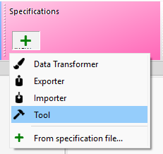
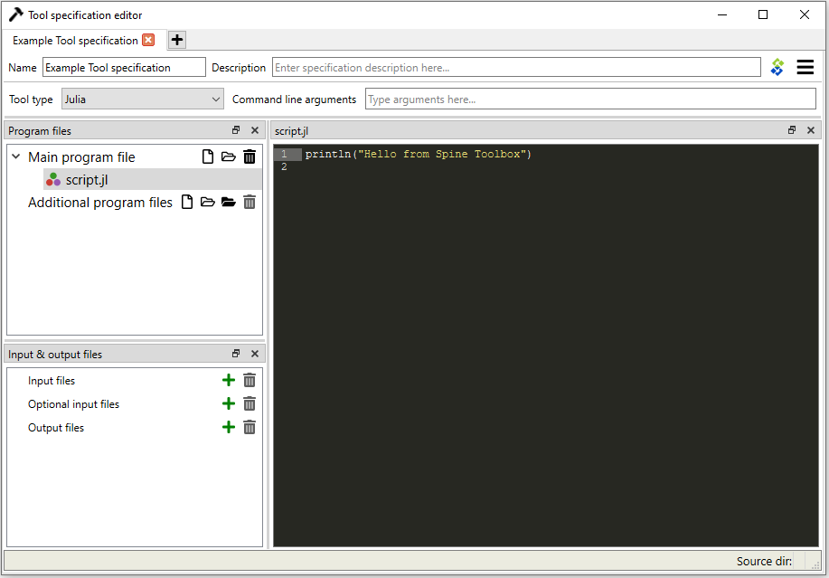

.. Tool specification editor documentation
   Created 15.1.2019

.. |file| image:: ../../spinetoolbox/ui/resources/file.svg
   :width: 16
.. |play-all| image:: ../../spinetoolbox/ui/resources/project_item_icons/play-circle-solid.svg
   :width: 16
.. |play-selected| image:: ../../spinetoolbox/ui/resources/project_item_icons/play-circle-regular.svg
   :width: 16
.. |insert-tag| image:: ../../spinetoolbox/ui/resources/double-at.svg
   :width: 16

.. _Tool specification editor:

*************************
Tool specification editor
*************************

This section describes how to make a new Tool specification and how to edit existing Tool specifications.

To execute a Julia, Python, GAMS, or an executable script in Spine Toolbox, you must first create a Tool
specification to your project. You can open the Tool specification editor in several ways. One way is to press the
Tool icon with a plus button in the *Project* dock widget. This presents you a pop-up menu with the *New*
and *Add existing...* options.

When you click on *New* the following form pops up.

.. image:: img/edit_tool_specification_blank.png
   :align: center

Start by giving the Tool specification a name. Then select the type of the Tool. You have four options (Julia,
Python, GAMS or Executable). Then select, whether you want the Tool specification to be executed in the work directory or
in its source directory (See :ref:`Terminology` section). You can give the Tool specification a description,
describing what the Tool specification does. Main program file is the main file of your simulation model, or an
executable script. You can create a blank file into a new directory by pressing the |file| button and selecting
*Make new main program* or you can browse to find an existing main program file by pressing the same button and
selecting *Select existing main program*.

Command line arguments can be appended to the actual command that
Spine Toolbox executes in the background. For example, you may have a Windows batch file called *do_things.bat*,
which accepts command line arguments *a* and *b*.
Writing :literal:`a b` on the command line arguments field in the tool specification editor is the equivalent
of running the batch file in command prompt with the command :literal:`do_things.bat a b`.
See `Command line argument tag expansion`_ for more information on the command line arguments.

*Additional source files* is a list of files that the main program requires in order to run. You can add
individual files or whole directories at once to this list.

.. tip:: You can also drag&drop a directory from your operating systems File Explorer into the *Additional
   source files* list.

*Input files* is a list of input data files that the program **requires** in order to execute. You can also add
directories and subdirectories. Wildcards are **not** supported (see Optional input files).

Examples:

- **data.csv** -> File is copied to the same work directory as the main program
- **input/data.csv** -> Creates directory input/ to the work directory and copies file *data.csv* there
- **output/** -> Creates an empty directory output/ into the work directory

*Optional input files* are files that may be utilized by your program if they are found. Unix-style wildcards
*?* and *\** are supported.

Examples:

- **data.csv** -> If found, file is copied to the same work directory as the main program
- **\*.csv** -> All found .csv files are copied to the same work directory as the main program
- **input/data_?.dat** -> All found files matching the pattern *data_?.dat* are copied into input/ directory in
  the work directory.

*Output files* are files that will be archived into a timestamped result directory of the Tool's project directory
after the Tool specification has finished execution. Unix-style wildcards *?* and *\** are supported.

Examples:

- **results.csv** -> File is copied from work directory into results directory
- **\*.csv** -> All .csv files from work directory are copied into results directory
- **output/*.gdx** -> All GDX files from the work directory's output/ subdirectory will be copied to into output/
  subdirectory in the results directory.

When you are happy with your Tool specification, click Ok, and you will be asked where to save the Tool specification file.
It is recommended to save the file into the same directory where the main program file is located. The Tool
specification file is a text file in JSON format and has an extension *.json*

.. tip:: Only *name*, *type*, and *main program file* fields are required to make a Tool specification. The other
   fields are optional.

Here is a minimal Tool specification for a Julia script *script.jl*

.. note::

   Under the hood, the contents of the Tool specification are saved to a *Tool specification file* in JSON
   format. Users do not need to worry about the contents of these files since reading and writing them is
   managed by the app. For the interested, here are the contents of the *Tool specification file* that we
   just created.::

      {
          "name": "Example Tool specification",
          "description": "",
          "tooltype": "julia",
          "execute_in_work": true,
          "includes": [
              "script.jl"
          ],
          "inputfiles": [],
          "inputfiles_opt": [],
          "outputfiles": [],
          "cmdline_args": ""
      }

After the user has clicked Ok and saved the file, the new Tool specification has been added to the project.

.. image:: img/project_dock_widget_with_one_tool_specification.png
   :align: center

To edit this Tool specification, just right-click on the Tool specification name and select `Edit Tool specification` from the
context-menu.

You are now ready to execute the Tool specification in Spine Toolbox. You just need to select a Tool item in the
*Design view*, set the specification *Example Tool specification* to it, and click |play-all| or |play-selected|
button.

Command line argument tag expansion
-----------------------------------

Spine Toolbox supports a number of special command line arguments called *tags* that get replaced by information
relevant to a Tool's current connections. For example, the :literal:`@@url-inputs@@` tag expands to a list of input
database URLs. If the command line arguments for the *Model* tool in the image below were
:literal:`--input-database=@@url-inputs@@` the tool would be executed by
:literal:`python tool_script.py --input_database=sqlite:///input_database.sqlite` command
in case *Input data*'s database URL was :literal:`sqlite:///input_database.sqlite`.

.. image:: img/partial_dag_input_datastore-tool-output_data_store.png
   :align: center

The |insert-tag| button next to the command line arguments field in Tool Specification editor
gives a quick access to insert the tags into the field.

Below is a list of the command line argument tags that are currently available:

- :literal:`@@url_inputs@@`: a space separated list of database URLs provided by all input data stores.
- :literal:`@@url_outputs@@`: a space separated list of database URLs provided by all output data stores.
- :literal:`@@url:<data store name>@@`: the url provided by a named data store connected to the tool.
- :literal:`@@optional_inputs@@`: a space separated list of tool's optional input files.
