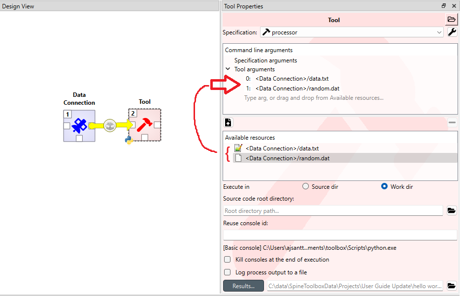

.. Tool specification editor documentation

.. |folder_open| image:: ../../spinetoolbox/ui/resources/menu_icons/folder-open-regular.svg
   :width: 16
.. |folder_open_solid| image:: ../../spinetoolbox/ui/resources/menu_icons/folder-open-solid.svg
   :width: 16
.. |file-regular| image:: ../../spinetoolbox/ui/resources/file-regular.svg
   :width: 16
.. |play-all| image:: ../../spinetoolbox/ui/resources/menu_icons/play-circle-solid.svg
   :width: 16
.. |play-selected| image:: ../../spinetoolbox/ui/resources/menu_icons/play-circle-regular.svg
   :width: 16

.. _Tool specification editor:

*************************
Tool Specification Editor
*************************

This section describes how to make a new Tool specification and how to edit existing Tool specifications.

.. contents::
   :local:

General
-------

To execute a Julia, Python, GAMS, or an executable script in Spine Toolbox, you must first create a Tool
specification for your project. You can open the Tool specification editor in several ways.
One way is to press the arrow next to the Tool icon in the toolbar to expand the Tool specifications,
and then press the *New...* button.

.. image:: img/open_tool_specification_editor.png
   :align: center

When you press *New...* the following form pops up;

Start by giving the Tool specification a name. Then select the type of the Tool. You have four options (Julia,
Python, GAMS or Executable). You can give the Tool specification a description,
describing what the Tool specification does. Main program file is the main file of your tool, i.e. a
script that can be passed to Julia, Python, GAMS, or the system shell.
You can create a blank file by pressing the |file-regular| button,
or you can browse to find an existing main program file by pressing the |folder_open| button.

Command line arguments can be appended to the actual command that
Spine Toolbox executes in the background. For example, you may have a Windows batch file called ``do_things.bat``,
which accepts command line arguments `a` and `b`.
Writing `a b` on the command line arguments field in the tool specification editor is the equivalent
of running the batch file in command prompt with the command ``do_things.bat a b``.

.. tip:: Another way to pass arguments to a Tool is to write them into the *Tool arguments*
   drop-down list in the **Properties** dock widget. There it is possible to also rearrange existing
   arguments or to select available resources that are provided by other project items as arguments.

   Unlike the arguments set in Tool Specification Editor, the arguments in **Properties** are *Tool specific*.

*Additional source files* is a list of files that the main program requires in order to run. You can add
individual files the same way as with the main program file or whole directories at once by pressing the
|folder_open_solid| button.

*Input files* is a list of input data files that the program **requires** in order to execute. You can also add
directories and subdirectories. Wildcards are **not** supported (see Optional input files).

Examples:

- **data.csv** -> File is copied to the same work directory as the main program
- **input/data.csv** -> Creates directory input/ to the work directory and copies file *data.csv* there
- **output/** -> Creates an empty directory output/ into the work directory

*Optional input files* are files that may be utilized by your program if they are found. Unix-style wildcards
``?`` and ``*`` are supported.

Examples:

- **data.csv** -> If found, file is copied to the same work directory as the main program
- **\*.csv** -> All found .csv files are copied to the same work directory as the main program
- **input/data_?.dat** -> All found files matching the pattern *data_?.dat* are copied into input/ directory in
  the work directory.

*Output files* are files that will be archived into a timestamped result directory inside Tool's data directory
after the Tool specification has finished execution. Unix-style wildcards ``?`` and ``*`` are supported.

Examples:

- **results.csv** -> File is copied from work directory into results directory
- **\*.csv** -> All .csv files from work directory are copied into results directory
- **output/*.gdx** -> All GDX files from the work directory's output/ subdirectory will be copied into output/
  subdirectory in the results directory.

When you are happy with your Tool specification, press **Ctrl+S** to save it. You will see a message in the Event log
(back in the main Spine Toolbox window), specifying the path of the saved specification file.
The Tool specification file is a text file in JSON format and has an extension *.json*
You can change the location by pressing [change].
Also, you need to save your project for the specification to stick.

.. tip:: Only *name*, *type*, and either *main program file* or *command* fields are required to make a Tool
   specification. The other fields are optional.

Here is a minimal Tool specification for a Julia script *script.jl*

.. image:: img/minimal_tool_specification.png
   :align: center

.. note::

   Under the hood, the contents of the Tool specification are saved to a *Tool specification file* in JSON
   format. Users do not need to worry about the contents of these files since reading and writing them is
   managed by the app. For the interested, here are the contents of the *Tool specification file* that we
   just created.::

      {
       "name": "Example Tool specification",
       "tooltype": "julia",
       "includes": [
           "script.jl"
       ],
       "description": "",
       "inputfiles": [],
       "inputfiles_opt": [],
       "outputfiles": [],
       "cmdline_args": [],
       "includes_main_path": "../../.."
      }

After you have saved the specification, the new Tool specification has been added to the project.

To edit this Tool specification, just right-click on the Tool specification name and select `Edit specification` from the
context-menu.

You are now ready to execute the Tool specification in Spine Toolbox. You just need to select a Tool item in the
**Design view**, set the specification *Example Tool specification* for it, and click |play-all| or |play-selected|
button.

Input & Output Files in Practice
--------------------------------

The file names can be either hard coded or not. For example, you could have a script that requires (hard coded
in the script) a file `input.dat` and optionally works with a bunch of files that are expected to have the
`.csv` extension. In that case you would define

- `input.dat` as an Input file
- `*.csv` as Optional input files

The *Output files* work similarly; you can hard code the entire file name or use wildcards for *Optional output files*.

When specifying the *Input* and *Output files* in the Specification editor, Toolbox will copy the files to the Tool's
work directory when the Tool is executed, so they are available for the script in a known location. Note, that you
can specify subdirectories for the files as well. These will be relative to the work directory.

These options expect some level of hard-coding: file names, or at least file extensions as well as relative
locations to the work directory need to be known when writing the Tool Spec script.

There is another, more general way to provide *Input files* to the script that does not require any kind of hard
coding: *command line arguments*. You can set them up in **Tool's Properties** tab. For example, in the project
below, a Data connection provides *Input files* for the workflow. The files are visible in the
*Available resources list* in **Tool's Properties** and they have been *dragged and dropped* into the the Tool
arguments list.

Now, the Python script can access the files using something like::

    import sys
    file_path1 = sys.argv[1]
    file_path2 = sys.argv[2]

Of course, more serious scripts would use the `argparse` module.
