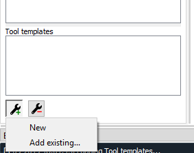
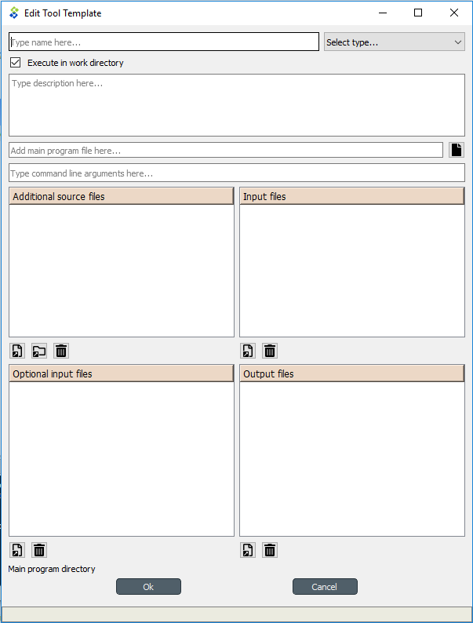
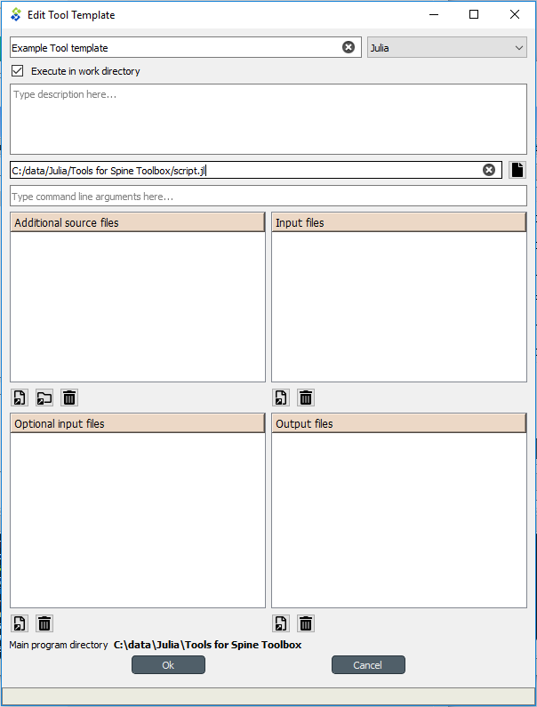
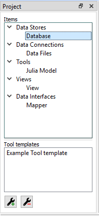

.. Tool template editor documentation
   Created 15.1.2019

.. _Tool template editor:

********************
Tool template editor
********************

This section describes how to make a new Tool template and how to edit existing Tool templates.

To execute a Julia, GAMS, or an executable script in Spine Toolbox, you must create a Tool template to your
project. You can open the Tool template editor in several ways. One way is to click on the Tool icon with a plus,
which presents you with a pop-up menu with the *New* and *Add existing...* choices.

When you click on *New* the following form pops up.

Start by giving the Tool template a name. Then select the type of the Tool. You have three options (GAMS, Julia, or
an Executable). Then select, whether you want the Tool template to be executed in the work directory or in its
source directory (See ``Terminology`` section in User Guide). You can give the Tool template a description,
describing what the Tool template does. Main program file is the main file of your simulation model, or an
executable script. You can create a blank file into a new directory by pressing the **+** button and selecting
*Make new main program* or you can browse to find an existing main program file by pressing the **+** button and
selecting *Select existing main program*. Command line arguments will be appended to the actual command that
Spine Toolbox executes in the background, e.g. if you have a Windows batch file called *do_things.bat*, which accepts
command line arguments *a* and *b*. If you set *a b* on the command line arguments. This is the equivalent of
running the batch file in command prompt with the command *do_things.bat a b*.

*Source files* is a list of files that the main program requires in order to run. You can add individual files or
whole directories at once to this list.

.. tip:: You can also drag&drop a directory from your operating systems File Explorer into the *Source files* list.

*Input files* is a list of input data files that the program requires in order to execute. You can also add
directories and subdirectories. Wildcards are **not** supported.

Examples:

- **data.csv** -> File is copied to the same work directory as the main program
- **input/data.csv** -> Creates directory input/ to the work directory and copies the files there
- **output/** -> Creates an empty directory output/ into the work directory

*Optional input files* are files that may be utilized by your program if they are found. Unix-style wildcards *?*
and *\** are supported.

Examples:

- **data.csv** -> If found, file is copied to the same work directory as the main program
- **\*.csv** -> All found CSV files are copied to the same work directory are the main program
- **input/data_?.dat** -> All found files matching the pattern *data_?.data* are copied into input/ directory in
  the work directory.

*Output files* are files that will be archived into a timestamped result directory of the Tool's project directory
after the Tool template has finished execution. Unix-style wildcards *?* and *\** are supported.

Examples:

- **results.csv** -> File is copied from work directory into results directory
- **\*.csv** -> All CSV files from work directory are copied into results directory
- **output/*.gdx** -> All GDX files from the work directory's output/ subdirectory will be copied to into output/
  subdirectory in the results directory.

When you are happy with your Tool template, click Ok, and you will be asked where to save the Tool template file.
It is recommended to save the file into the same directory where the main program file is located. The Tool
template file is a text file in JSON format and has an extension *.json*

.. tip:: Only *name*, *type*, and *main program file* fields are required to make a Tool template. The other
   fields are optional.

Here is a minimal Tool template for a Julia script *script.jl*

.. note::

   Under the hood, the contents of the Tool template are saved to a *Tool template definition file* in JSON
   format. Users do not need to worry about the contents of these files since reading and writing them is
   managed by the app. For the interested, here's the contents of the *Tool template definition file* that we
   just created.::

      {
          "name": "Example Tool template",
          "description": "",
          "tooltype": "julia",
          "execute_in_work": true,
          "includes": [
              "script.jl"
          ],
          "inputfiles": [],
          "inputfiles_opt": [],
          "outputfiles": [],
          "cmdline_args": ""
      }

After the user has clicked Ok and saved the file, the new Tool template has been added to the project.

To edit this Tool template, just right-click on the Tool template name and select `Edit Tool template` from the
context-menu.

You are now ready to execute the Tool template in Spine Toolbox. You just need to select a Tool item in the
*Design view*, set the template *Example Tool template* to it, and click execute.
