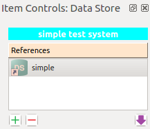

..  Tutorial for Spine Toolbox
    Author: Pekka Savolainen <pekka.t.savolainen@vtt.fi>, Manuel Marin <manuelma@kth.se>
    Date created: 18.6.2018

.. |ds_icon| image:: ../../spinetoolbox/ui/resources/ds_icon.png
             :width: 24
.. |plus| image:: ../../spinetoolbox/ui/resources/plus.png
          :width: 16
.. |minus| image:: ../../spinetoolbox/ui/resources/minus.png
           :width: 16
.. |import| image:: ../../spinetoolbox/ui/resources/import.png
            :width: 16

Tutorial
========

Welcome to the tutorial for Spine Toolbox. This tutorial covers the following topics:

.. contents::
   :local:

Knowing the Interface
---------------------

The Spine Toolbox interface has two main components, *Main View* and *Contents*:

- **Main View** lets you visualize and manipulate your project in a pictorial way. Here you can
  place your items, and define the connections between items to build a
  *data processing chain*.
- **Contents** provides more concise views of your project into three tabs:

   - The *Items* tab gives you access to your project items grouped by category:
     Data Stores, Data Connections, Tools and Views.
   - The *Connections* tab lets you see and modify connections between items.
   - *Templates* is for managing tools that Tool items can run.

Besides these two main views, there are a few *docked widgets*:

- **Item Controls** shows specific controls for the currently selected item.
- **Event Log** is where Spine Toolbox informs you about everything that's going on.
- **Subprocess Output** shows the output of command line tools.
- **Julia REPL** is the console where Julia tools are executed.

.. tip:: You can drag-and-drop the docked widgets around the screen,
   customizing the interface at your will.
   Also, you can select which ones are shown/hidden using the **View** menu in the main menu bar.
   Spine Toolbox will remember your configuration between sessions.

.. tip:: Most elements in the Spine Toolbox's interface are equipped with *tool tips*. Leave your mouse
   cursor over an element (button, view, etc.) for a moment to make the tool tip appear.

Creating a Project
------------------

In the main menu bar, click **File**, **New...** to open the *New Project* form.
Here you can give the project a name and,
optionally, a description.
Type 'tutorial' in the name field ---we will leave the description empty this time--- and click **Ok**.

Congratulations, you have created a new project.

.. tip:: You can also create a new project with the keyboard combination *Ctrl+N*.

Working with Data Stores
------------------------

Let's add a Data Store to the project. You can do this in either of two ways:

A) In the main menu bar, click **Edit**, **Add Data Store**.
B) Drag-and-drop the *Data Store* icon (|ds_icon|) from the *Add Item* toolbar onto the *Main View*.

The *Add Data Store* form will appear, allowing you to enter a name and description for the Data Store.
Type 'simple test system' in the name field and click **Ok**.
Now you should see the newly added item in the *Main View*, and also in the *Contents* pane, *Items* tab. It should
look similar to this:

.. image:: img/simple_test_system.png
   :align: center

.. note:: The dotted square in the center of the item's figure is the *connector* button,
   and serves to make connections
   between this and other items in your project. You don't have other items yet so we'll leave
   this button alone for now.

Click anywhere in the Data Store item (outside of the connector button) to select it. This will also show
its controls in the *Item Controls* area.

.. tip:: You can also select a project item
   by clicking on its name in the *Contents* pane, *Items* tab.

With the Data Store item selected,
the *Item Controls* area should show two lists ---both empty for now---, *References* and *Data*:

- **References** lists sources where this Data Store can import data from. (These typically live *outside*
  the current Spine Toolbox project.)
- **Data** lists the contents of this Data Store's folder, where imported data is saved.
  You can open this folder in your file explorer by clicking **Open directory**.

Creating a new Spine database
~~~~~~~~~~~~~~~~~~~~~~~~~~~~~

Let's add a new reference to this Data Store.
Click on the *plus* button (|plus|) and select **New Spine SQLite database** in the popup menu.
A dialog will show up to let you choose a name for the database. Type 'simple' and click **Ok**.

Now you should see the newly added reference in the list. It should look like this:

.. tip:: To remove a reference, select it by clicking on its name
   and then press the *minus* button (|minus|).
   You can also remove all references at once by pressing this button while nothing is selected.

Using the Spine Data Store form
~~~~~~~~~~~~~~~~~~~~~~~~~~~~~~~

Double click on the 'simple' reference we've just created to open the **Spine Data Store** form. This is
a dedicated interface that you can use to manipulate databases in the Spine format. The interface is
divided in three main areas:

- **Object tree** displays the database contents in form of a tree,
  with object classes at the top level.
- **Object parameter** displays parameters associated with the object that is
  currently selected in the *Object tree*.
- **Relationship parameter** displays parameters associated with
  any relationships involving the currently selected object.

Right now you should see a list of pre-defined object classes in the *Object tree*.

.. note:: These pre-defined classes
   correspond to the *generic data structure* that Spine uses to define energy models.

Let's add a new object to the 'unit' object class. Right-click over the item tagged 'unit' in the *Object tree*
and select **Add object** from the context menu. This will show a dialog where you can specify a name and
description for the new object. Enter 'coal_import' in the name field and click **Ok**. Now you
should see the newly added object in the *Object tree*, under the 'unit' class.

Repeat the operation to add an object called 'Leuven' to the 'node' class.

Now let's add a relationship class between the 'node' and 'unit' object classes. Right-clik on 'node' to display
the context menu, and this time select **Add relationship class**.
A new dialog will show ---enter 'node_unit' in the name field,
and select 'unit' from the drop-down list. Click **Ok** when you are done.
An item named 'node_unit' should appear now *both* under the 'coal_import' and 'Leuven' objects,
as below:

.. image:: img/object_tree_node_unit.png
  :align: center

Let's add a relationship of class 'node_unit' between the two objects we've created.
Right-click on the 'node_unit' relationship class
below the 'coal_import' object and select **Add relationship** in the context menu.
In the pop up dialog,
enter 'Leuven_coal_unit' in the name field and select 'Leuven' from the drop-down list (it should be
the only option available). Click **Ok**.

After this you should see an item called 'Leuven' under the 'node_unit' relationship class
(under the 'coal_import' object),
representing the newly added relationship.

Now expand the 'node_unit' relationship class under the 'Leuven' object. Here you will find an item named 'coal_import',
representing the same relationship but in the opposite sense:

.. image:: img/Leuven_coal_import.png
  :align: center

.. important:: Relationships in Spine are *omni-directional* (in simple terms, they work both ways).
   For this reason, every time you
   create a relationship, Spine Toolbox will create  the symmetric relationship
   for you.

Let's go one step ahead and add a couple of parameters to the 'unit' class. Right click on the 'unit'
class and select **Add parameter** in the context menu. This will automatically activate
the *Definition* tab in the *Object parameter* pane, add a new record to that table, and start
editing the *parameter_name* field. You just need to type the parameter name now.
Type 'conversion_cost' and press *Enter*.

.. note:: Don't worry about the other fields in the *parameter* table for now. They are
   only there to support more sophisticated parameter definitions to be used, for instance,
   in time-varying energy models.

Repeat the operation to add a parameter named 'capacity_to_flow' to the 'unit' class. After this, you
should see something like this in the *Object parameter* pane, *Definition* tab:

.. image:: img/parameter_definition.png
  :align: center

To finish our session with the *Spine Data Store* form, we will add a new parameter value. Right-click
on the 'coal_import' object under the 'unit' class, and select **Add parameter value** in the
context menu. This will automatically activate the *Value* tab in the *Object parameter* pane, add a new
record to that table, and expand a list of available names over the *parameter_name* field. Here you should see
the names of the two parameters we've just added. Click on 'conversion_cost'.

Ater this, you will be automatically prompted to edit the *index* field.
Accept the current value (1) by pressing *Enter*.
Now let's edit the *value* field: just select this field (by clicking on it) and type '12' followed by *Enter*.
After all this, the table should be looking like this:

.. image:: img/parameter_value.png
  :align: center

It's time to save our work. At the bottom of the form, you will find a text field where you can type a commit message.
Type 'Add coal_import, Leuven, and conversion_cost.' (or any other meaningful message)
and then click on the **Commit** button. That's it.
Spine Toolbox has just updated the 'simple' reference with the newly inserted data.

Click **Close** to go back to the main interface.

Import references
~~~~~~~~~~~~~~~~~

Select the 'simple' reference in the *References* list and then click on the *import* button (|import|).
This will copy the 'simple' database into a SQLite file called 'simple.sqlite',
and put in the Data Store folder.
After this, the *Item Controls* should look similar to this:

.. image:: img/item_controls_data_store_import.png
  :align: center

You can open the 'simple.sqlite' file using the *Spine Data Store* form by double-clicking on it (much in
the same way as you did with the 'simple' reference). Go ahead and do it. You will find the exact same
content that you just inserted in the 'simple' database.

Close the *Spine Data Store* form to go back to the main interface. Now click on **Open directory** in
*Item Controls* to open the Data Store folder in your file explorer.
You should see the 'simple.sqlite' file sitting there.
Take note of the file's path for the next step in the tutorial.
If you are running Spine Toolbox on Windows from the default location, the path should
be something like ``C:\\SpineToolbox-0.0.13\projects\tutorial\simple_test_system\simple.sqlite``.

.. tip:: You can share the 'simple.sqlite' file with other Spine Toolbox users so they can see
   (and possible continue) your work. All they need to do is add a reference to the 'simple.sqlite'
   file in their project, using the procedure described in the next subsection.

Add an SQLite reference
~~~~~~~~~~~~~~~~~~~~~~~

Just for illustration purposes, we will add a reference to the recently created 'simple.sqlite'
file. Please note that this is not something you would typically do when working on a real project.

Click on the plus button (|plus|) in the
*Item Controls* area to add a new reference, and select **Other...** in the popup menu.
This will open the *Add Database Reference* form.
Here, select the 'sqlite' dialect in the drop-down list at the top.

.. note:: The *Add Database Reference* form allows you to access Spine databases in a number of
   SQL dialects. If you try to use a dialect that's currently not supported by your system,
   Spine Toolbox will offer to install the necessary packages for you. Just choose the
   appropriate package manager (*conda* or *pip*) when prompted. If you're unsure
   about which package manager to choose, it's usually safe to try one and then the other and see
   what works.

With the 'sqlite' dialect selected, click on the **Browse...** button. This will
open a system dialog to let you
select an SQLite file from your computer. Find the 'simple.sqlite' file (recall the path
from the previous step) and click **Open**. Back in the *Add Database Reference* form, click
**Ok**. Now you should see an item called 'simple.sqlite' just below 'simple' in your *References*
list.

.. TODO
.. Working with Data Connections
.. -----------------------------
..
..
.. Working with Tools
.. ------------------
..
..
.. Using the Julia REPL
.. --------------------
..
..
.. Miscellaneous
.. -------------
