..  Two Hydro tutorial
    Created: 30.7.2021


.. |execute| image:: ../../spinetoolbox/ui/resources/menu_icons/play-circle-solid.svg
             :width: 16


*********************
Hydro Power Planning
*********************

Welcome to this Spine Toolbox tutorial for building hydro power planning models.
The tutorial guides you through the implementation of different ways of modelling 
hydrodologically-coupled hydropower systems.

.. contents::
   :local:

Introduction
============
This tutorial aims at demonstrating how we can model a hydropower system in Spine (`SpineOpt.jl` and `Spine-Toolbox`)
with different assumptions and goals. It starts off by setting up a simple model of system of two hydropower
plants and gradually introduces additional features. The goal of the model is to capture 
the combined operation of two hydropower plants (Språnget and Fallet) that operate on the 
same river as shown in the picture bellow. Each power plant has its own reservoir and 
generates electricity by discharging water. The plants might need to spill water, i.e., 
release water from their reservoirs without generating electricity, for various reasons.
The water discharged or spilled by the upstream power plant follows the river route and
becomes available to the downstream power plant.

.. _fig-two-hydro:
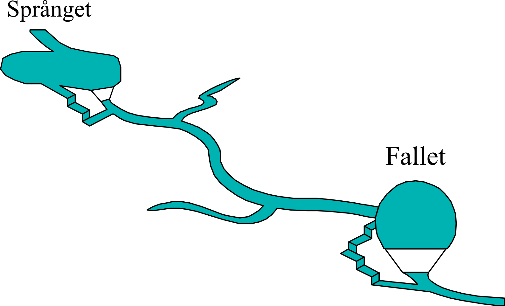
   
   A system of two hydropower plants.

In order to run this tutorial you must first execute some preliminary steps from the 
`Simple System <./simple_system.html>`_
tutorial. Specifically, execute all steps from the `guide <./simple_system.html#guide>`_,
up to and including the step of `importing-the-spineopt-database-template <./simple_system.html#importing-the-spineopt-database-template>`_.
It is advisable to go through the whole tutorial in order to familiarise yourself with Spine.

.. note:: Just remember to give a different name for the Spine Project of the hydropower tutorial (e.g., ‘Two_hydro’) 
   in the corresponding step, so to not mix up the Spine Toolbox projects! 

That is all you need at the moment, you can now start inserting the data.

Setting up a Basic Hydropower Model
===================================

For creating a SpineOpt model you need to create `Objects`, `Relationships` (associating the objects), and in some cases, parameters values accompanying them.
To do this, open the input database using the Spine DB Editor (double click on the input database in the `Design View` pane of Spine Toolbox).

.. note:: To save your work in the Spine DB Editor you need to `commit` your changes (please check the Simple System tutorial for how to do that).
   As a good practice, you should commit often as you enter the data in the model to avoid data loss.

Defining objects
~~~~~~~~~~~~~~~~

Commodities
```````````

Since we are modelling a hydropower system we will have to define two commodities, water and electricity. In the Spine DB editor, locate the `Object tree`, 
expand the root element if required, right click on the commodity class, and select `Add objects` from the context menu.
In the `Add objects` dialogue that should pop up, enter the object names for the commodities as you see in the image below and then press Ok.

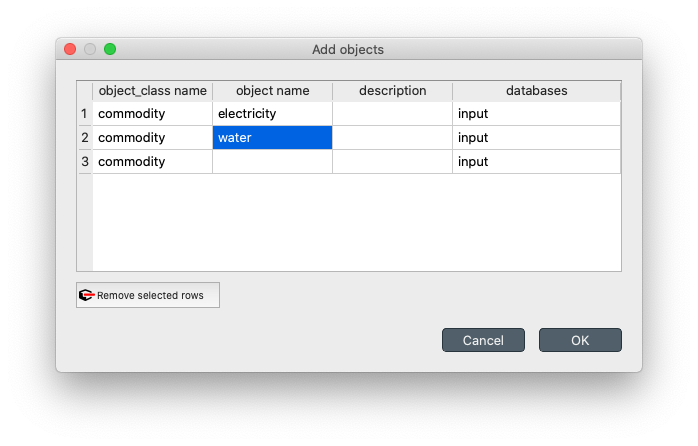
   
   Defining commodities.

.. _node:

Nodes
`````

Follow a similar path to add nodes, right click on the node class, and select `Add objects` from the context menu.
In the dialogue, enter the node names as shown:

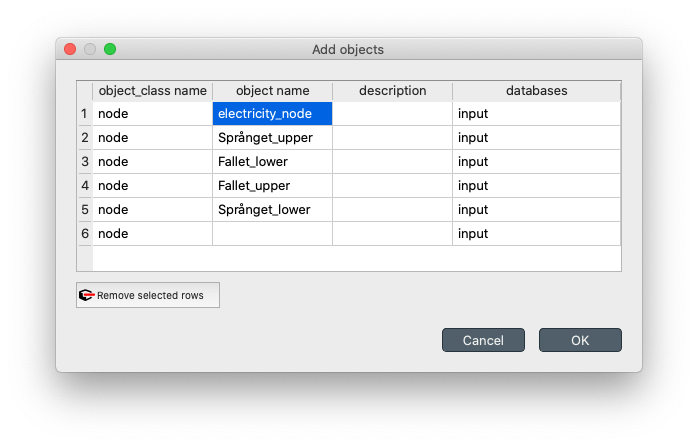
   
   Defining nodes.

Nodes in SpineOpt are used to balance commodities. As you noticed, we defined two nodes for each hydropower station
(water nodes) and a single electricity node. This is one possible way to model the hydropower plant operation. 
This will become clearer in the next steps, but in a nutshell, the `upper` node represents the water arriving at each plant, 
while the `lower` node represents the water that is discharged and becomes available to the next plant.

Connections
```````````

Similarly, add connections, right click on the connection class, select `Add objects` from the context menu and
add the following connections:

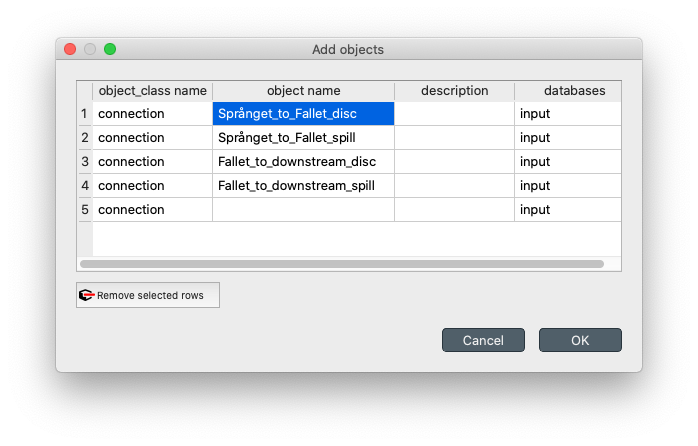
   
   Defining connections.

Connections enable the nodes to interact. Since, for each plant we need to model the amount of water that is
discharged and the amount that is spilled, we must define two connections accordingly. When defining relationships
we shall associate the connections with the nodes.

.. _unit:

Units
`````
To convert from one type of commodity associated with one node to another, you need a unit. You guessed it!
Right click on the unit class, select `Add objects` from the context menu and add the 
following units:

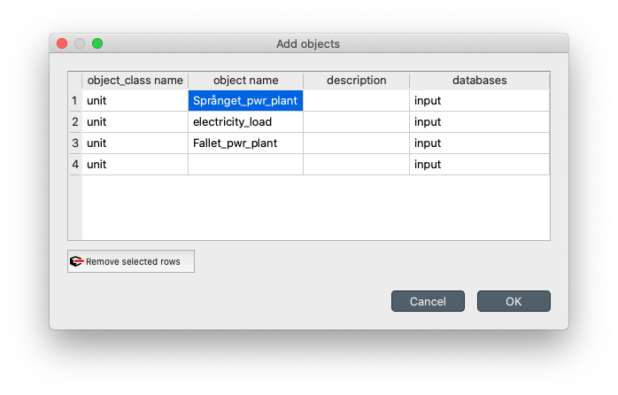
   
   Defining units.

We have defined one unit for each hydropower plant that converts water to electricity and an additional unit that we
will use to model the income from selling the electricity production in the electricity market.

Relationships
~~~~~~~~~~~~~

.. _node__commodity:

Assinging commodities to nodes
``````````````````````````````
Since we have defined more than one commodities, we need to assign them to nodes.  In the Spine DB editor, locate the `Relationship tree`, 
expand the root element if required, right click on the `node__commodity` class, and select `Add relationships` from the context menu.
In the `Add relationships` dialogue, enter the following relationships as you see in the image below and then press Ok.

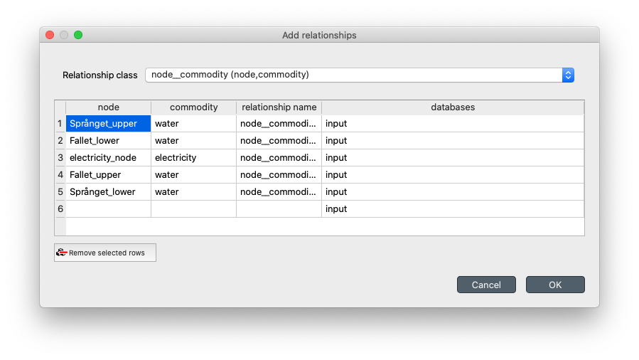
   
   Introducing `node__commodity` relationships.

Associating connections to nodes
````````````````````````````````
Next step is to define the topology of flows between the nodes. To do that insert the following relationships in the `connection__from_node` class:

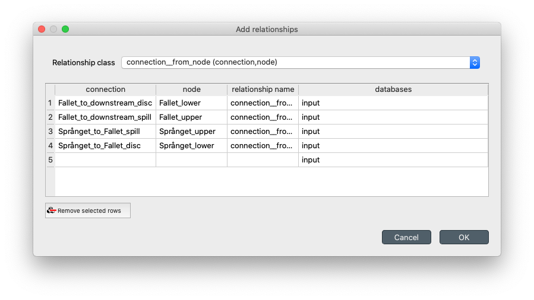
   
   Introducing `connection__from_node` relationships.

as well as the following the following `connection__node_node` relationships as you see in the figure:

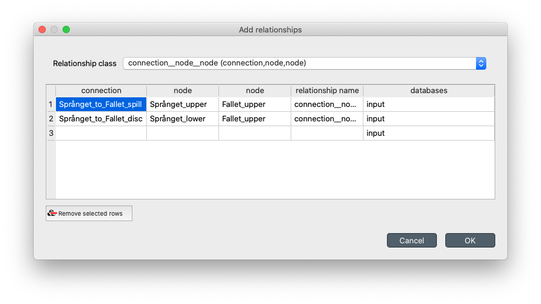
   
   Introducing `connection__node_node` relationships.

.. _unit_relationships:

Placing the units in the model
``````````````````````````````
To define the topology of the units and be able to introduce their parameters later on, you need to define 
the following relationships in the `unit__from_node` class:

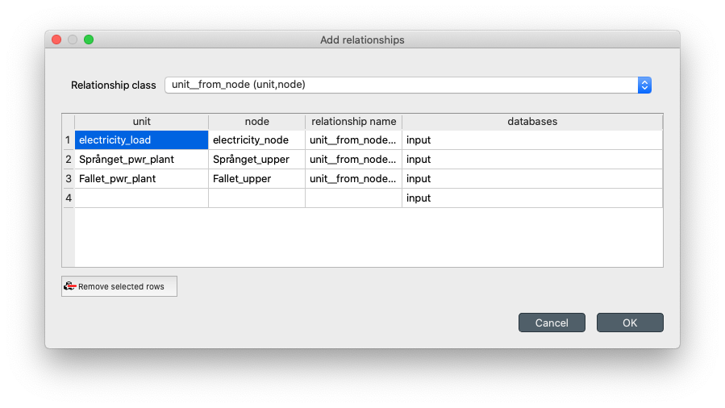
   
   Introducing `unit__from_node` relationships.

in the `unit__node_node` class:

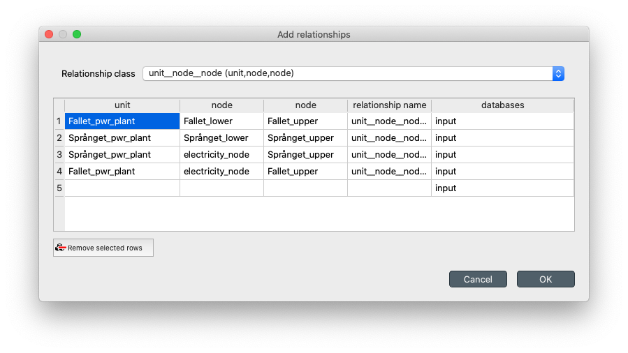
   
   Introducing `unit__node_node` relationships.

and in the `unit__to_node` class as you see in the following figure:

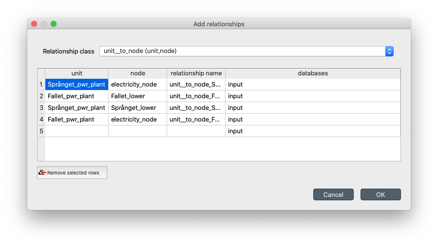
   
   Introducing `unit__to_node` relationships.


Defining the report outputs
```````````````````````````
To force Spine to export the optimal values of the optimization variables to the output database you need to 
specify them in the form of `report_output` relationships. Add the following relationships to the `report_output`
class:

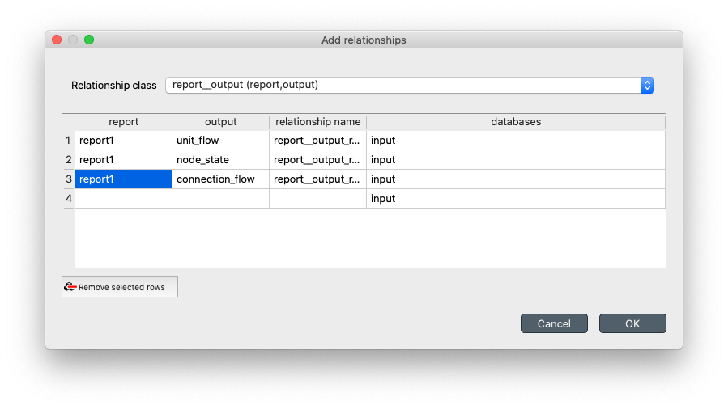
   
   Introducing report outputs with `report_output` relationships.

Objects and Relationships parameter values
~~~~~~~~~~~~~~~~~~~~~~~~~~~~~~~~~~~~~~~~~~

Defining model parameter values
```````````````````````````````

The specify modelling properties of both objects and relationships you need to introduce respective parameter values.
To introduce object parameter values first select the `model` class in the Object tree and enter the following values
in the `Object parameter value` pane:

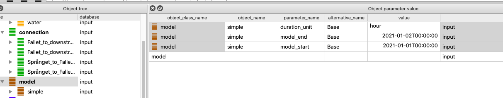
   
   Defining model execution parameters.

Observe the difference between the  `Object parameter value` and the `Object parameter definition` sub-panes of the  `Object parameter value` pane.
The first one is for the modeller to introduce values for specific parameters, while the second one holds the definition of all available parameters with their default values
(these are overwritten when the user introduces their own values). Feel free to explore the different parameters and their default values.
While entering data in each row you will also observe that, in most cases, clicking on each cell activates a drop-down list of elements that the user
must choose from. In the case of the `value` cells, however, unless you need to input a scalar value or a string, you should right-click on the cell and select
edit for specifying the data type of the parameter value. As you see in the figure above, for the first `duration_unit` parameter you 
is of type string, while the `model_start` and `model_end` parameters are of type Date time. The Date time parameters can be edited by right-clicking on the corresponding `value` cells,
selecting `Edit`, and then inserting the Date time values that you see in the figure above in the `Datetime` field using the correct format.

.. _node_parameters:

Defining node parameter values
```````````````````````````````

Going back to hydropower modelling, we need to specify several parameters for the nodes of the systems. In the same pane as before, but
this time selecting the `node` class from the `Object tree`, we need to add the following entries:

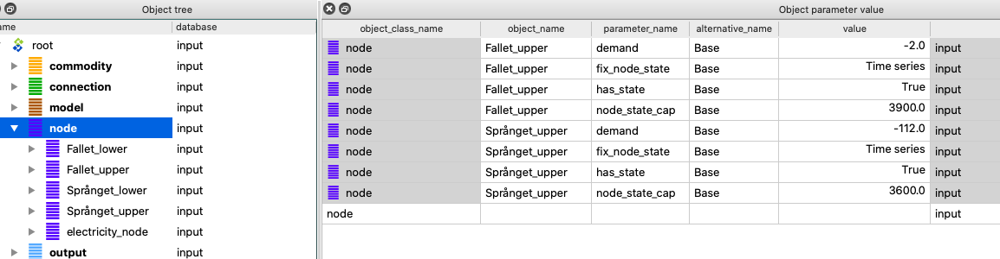
   
   Defining model execution parameters.

Before we go through the interpretation of each parameter, click on the following link for each `fix_node_state` parameter (`Node state Språnget <../../source/data/Spranget_node.txt>`_,
`Node state Fallet <../../source/data/Fallet_node.txt>`_), select all, copy the data and then paste them directly in the respective parameter value cell.
Spine should automatically detect and input the timeseries data as a parameter value. The data type for those entries should be `Timeseries` as shown in the figure above. 
Alternatively, you can select the data type as `Timeseries` and manually insert the data (values with their corresponding datetimes).

To model the reservoirs of each hydropower plant, we leverage the `state` feature that a node can have to represent storage capability. We only need to do this for one of the two nodes that we have used to model each plant and we choose the `upper` level node.
To define storage, we set the value of the parameter `has_state` as True (be careful to not set it as a string but select the boolean true value
by right clicking and selecting Edit in the respective cells). This activates the storage capability of the node. Then, we need to set the 
capacity of the reservoir by setting the `node_state_cap` parameter value. Finally, we fix the initial and final values of the reservoir by setting 
the parameter `fix_node_state` to the respective values (we introduce `nan` values for the time steps that we don't want to impose such constraints).
To model the local inflow we use the `demand` parameter but using the negated value of the actual inflow, due to the definition of the parameter in Spine 
as a **demand**.

Defining the temporal resolution of the model
`````````````````````````````````````````````

Spine automates the creation of the temporal resolution of the optimization model and even supports different temporal resolutions for different
parts of the model. To define a model with an hourly resolution we select the `temporal_block` class in the `Object tree` and we set the `resolution`
parameter value to `1h` as shown in the figure:

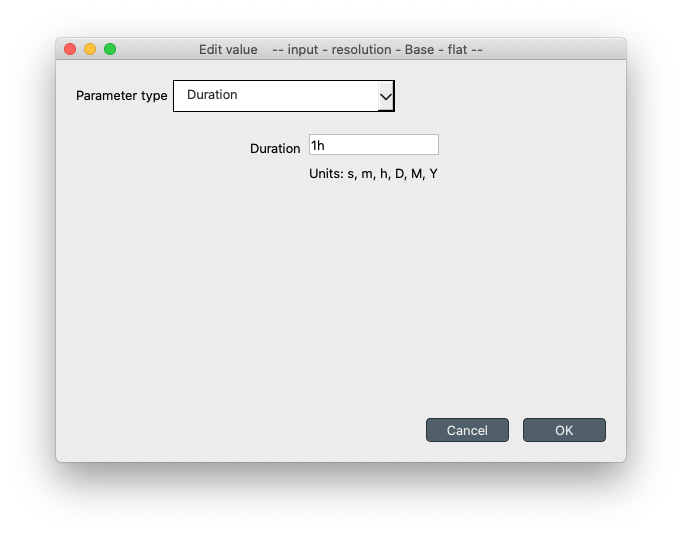
   
   Setting the temporal resolution of the model.


Defining connection parameter values
`````````````````````````````````````

The water that is discharged from Språnget will flow from `Språnget_lower` node to `Fallet_upper` through the `Språnget_to_Fallet_disc` connection,
while the water that is spilled will flow from `Språnget_upper` directly to to `Fallet_upper` through the `Språnget_to_Fallet_spill` connection.
To model this we need to select the `connection__node_node` class in the Relationship tree and add the following entries in the `Relationship parameter value` pane,
as shown next:

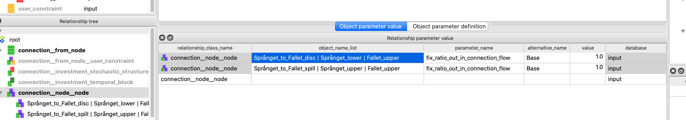
   
   Defining discharge and spillage ratio flows.


Defining unit parameter values
```````````````````````````````

Similarly, for each one of the `unit__from_node`, `unit__node_node`, and `unit__to_node` relationship classes we need to add the
the maximal water that can be discharged by each hydropower plant:

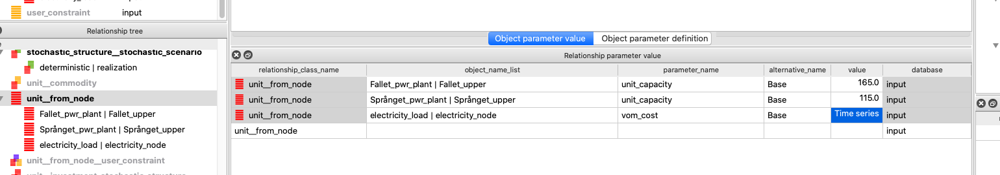
   
   Setting the maximal water discharge of each plant.

To define the income from selling the produced electricity we use the `vom_cost` parameter and negate the values of the electricity prices.
To automatically insert the timeseries data in Spine, click on the `Electricity prices timeseries <../../source/data/el_prices.txt>`_, select all values, copy, and paste them, after having selected
the value cell of the corresponding row. You can plot and edit the timeseries data by
double clicking on the same cell afterwards:

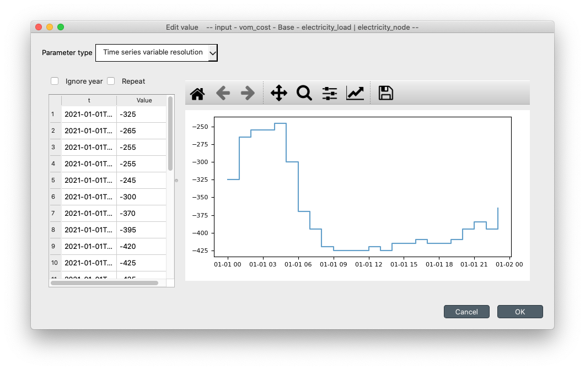
   
   Previewing and editing the electricity prices timeseries.

Carrying on with our hydropower model we must define the conversion ratios between the nodes. Assuming that water is not "lost" from the `upper`
node toward the `lower` node and electricity is produced with the discharged water with a given efficiency we define the following parameter
values for each hydropower plant, in the `unit__node_node` class:

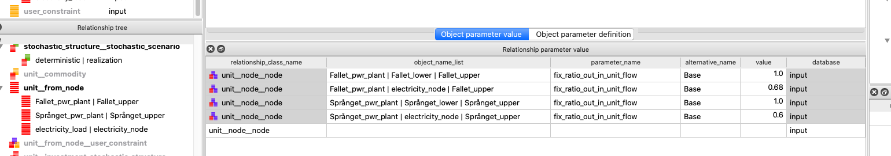
   
   Defining conversion efficiencies.

Lastly, we can define the maximal electricity production of each plant by inserting the following `unit__to_node` relationship parameter values:

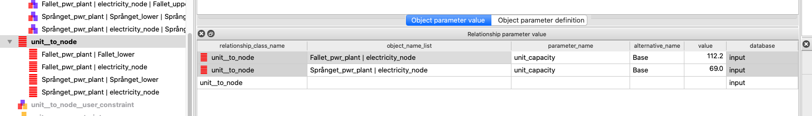
   
   Setting the maximal electricity production of each plant.

Hooray! You can now commit the database, close the Spine DB Editor and run your model! Go to the main Spine window and click on Execute |execute|.

.. _examine_results:

Examining the results
~~~~~~~~~~~~~~~~~~~~~

Select the output data store and open the Spine DB editor. To quickly plot some results, you can expand the unit class in the Object tree and select
the `electricity_load` unit. In the `Relationship parameter value` pane double click on the value cell of

   **report1|electricity_load|electricity_node|from_node|realization**

object name. This will open a plotting window from were you can also examine closer and retrieve the data, as shown in the next figure.
The `unit_flow` variable of the `electricity_load` unit represents the total electricity production in the system:

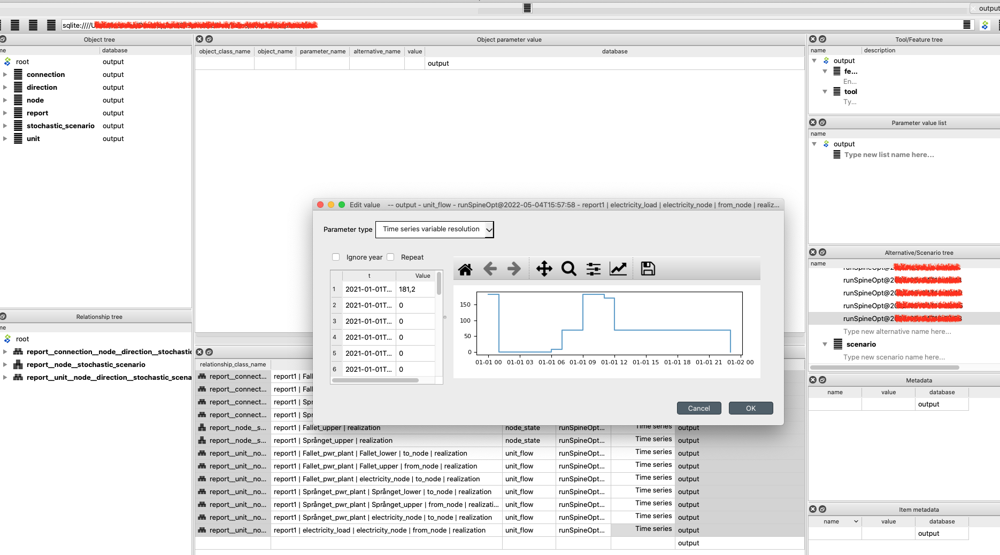

   Total electricity produced in the system.

Now, take to a minute to reflect on how you could retrieve the data representing the water that is discharged by each hydropower plant as shown in the next figure:

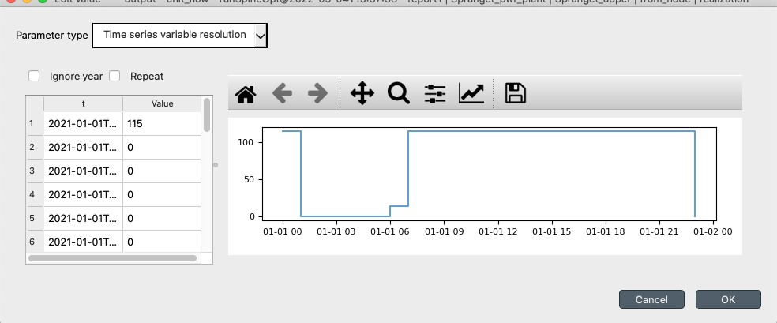

   Water discharge of Språnget hydropower plant.

The right answer is that you need to select some hydropower plant (e.g., Språnget) and then double-click on the value cell of the object name 
   
   **report1|Språnget_pwr_plant|Språnget_lower|to_node|realization**, or
   **report1|Språnget_pwr_plant|Språnget_upper|from_node|realization**. 
      
It could be useful to also reflect on why these objects give the same results, and what do the results from the third element represent. 
(Hint: observe the `to_` or `from_` directions in the object names). As an exercise, you can try to retrieve the timeseries data 
for spilled water as well as the water levels at the reservoir of each hydropower plant. 

You can further explore the model, or make changes in the input database to observe how these affect the
results, e.g., you can use different electricity prices, values for the reservoir capacity (and initialization points), as well as change
the temporal resolution of the model. All you need to do is commit the changes and run your model. Every time that you run the model, your 
results are appended in the output database with an execution timestamp. You can however filter your results per execution, by selecting 
the `Alternative` that you want from the `Alternative/Scenario tree` pane. You can use the exporter too to export specific variables in 
an Excel sheet. Alternatively, you can export all the data of the output database by going to the main menu (Press **Alt + F** to display it),
selecting **File -> Export**, then select the items that you want, click ok and export the data in Excel, or json format.

In the following, we extend this simple hydropower system to include more elaborate modelling choices.

.. note:: In each of the next sections, we perform incremental changes to the initial simple hydropower model.
   If you want to keep the database that you created, you can duplicate the database file (right-click on the input
   database and select **Duplicate and duplicate files**) and perform the changes in the new database. You need to
   configure the workflow accordingly in order to run the database you want (please check the Simple System tutorial for how to do that).


Maximisation of Stored Water
============================

Instead of fixing the water content of the reservoirs at the end of the planning period, we can consider that the remaining 
water in the reservoirs has a value and then maximize the value along with the revenues for producing electricity within the
planning horizon. This objective term is often called the **Value of stored water** and we can approximate it by assuming that 
this water will be used to generate electricity in the future that would be sold at a forecasted price. The water stored in the upstream hydropower
plant will become also available to the downstream plant and this should be taken into account.

To model the value of stored water we need to make some additions and modifications to the initial model.

   #. First, add a new node (see :ref:`adding nodes <node>`) and give it a name (e.g., `stored_water`). 
      This node will accumulate the water stored in the reservoirs at the end of the planning horizon. 
      Associate the node with the water commodity (see :ref:`node__commodity <node__commodity>`).
   
   #. Add three more units (see :ref:`adding units <unit>`); two will transfer the water at the end of the planning horizon in the new node that we just added
      (e.g., `Språnget_stored_water`, `Fallet_stored_water`), and one will be used as a `sink` introducing the value of stored water 
      in the objective function (e.g., `value_stored_water`). 

   #. To establish the topology of the new units and nodes (see :ref:`adding unit relationships <unit_relationships>`):
      
      * add a `unit__from_node` relationship, between the `value_stored_water` unit from the `stored_water` node,

      * add one `unit__node__node` relationship between the `Språnget_stored_water` unit with the `stored_water` and `Språnget_upper` nodes and another one for `Fallet_stored_water` unit with the `stored_water` and `Fallet_upper` nodes,

      * add a `unit__to_node` relationship between the `Fallet_stored_water` and the `stored_water` node and another one between the `Språnget_stored_water` unit and the `stored_water` node.

   #. Now we need to make some changes in object parameter values.

      * Extend the planning horizon of the model by one hour, i.e., change the `model_end` parameter value to `2021-01-02T01:00:00` (right-click on the value cell, click edit and paste the new datetime in the popup window).

      * Remove the `fix_node_state` parameter values for the end of the optimization horizon as you seen in the following figure: double click on the `value` cell of the `Språnget_upper` and `Fallet_upper` nodes, select the third data row, right-click, select `Remove rows`, and click OK.

      .. figure:: img/two_hydro_fix_node_state.png
         :width: 600px
         :align: center

         Modify the `fix_node_state` parameter value of `Språnget_upper` and `Fallet_upper` nodes.


   #. Finally, we need to add some relationship parameter values for the new units:

      * Add a `vom_cost` parameter value on a `value_stored_water|stored_water` instance of a `unit__from_node` relationship, as you see in the figure bellow. For the timeseries you can copy-paste the data directly from `this link <../../source/data/value_stored_water_vom.txt>`_. If you examine the timeseries data you'll notice that we have imposed a zero cost for all the optimisation horizon, while we use an assumed future electricity value for the additional time step at the end of the horizon.

      .. figure:: img/two_hydro_max_stored_water_unit_values.png
         :width: 800px
         :align: center

         Adding `vom_cost` parameter value on the `value_stored_water` unit.
         
      * Add two `fix_ratio_out_in_unit_flow` parameter values as you see in the figure bellow. The efficiency of `Fallet_stored_water` is the same as the `Fallet_pwr_plant` as the water in Fallet's reservoir will be used to produce electricity by the the Fallet plant only. On the other hand, the water from Språnget's reservoir will be used both by Fallet and Språnget plant, therefore we use the sum of the two efficiencies in the parameter value of `Språnget_stored_water`.

      .. figure:: img/two_hydro_max_stored_water_unit_node_node.png
         :width: 800px
         :align: center

         Adding `fix_ratio_out_in_unit_flow` parameter values on the `Språnget_stored_water` and `Fallet_stored_water` units.

You can now commit your changes in the database, execute the project and :ref:`examine the results <examine_results>`! 
As an exercise, try to retrieve the value of stored water as it is calculated by the model.


Spillage Constraints - Minimisation of Spilt Water
==================================================

It might be the case that we need to impose certain limits to the amount of water that is spilt on each time step of the
planning horizon, e.g., for environmental reasons, there can be a minimum and a maximum spillage level. At the same time,
to avoid wasting water that could be used for producing electricity, we could explicitly impose the spillage minimisation
to be added in the objective function.

   #. Add one unit (see :ref:`adding units <unit>`) to impose the spillage constraints to each plant and name it (for example `Språnget_spill`).

   #. Remove the `Språnget_to_Fallet_spill` connection (in the Object tree expand the connection class, right-click on `Språnget_to_Fallet_spill`, and the click **Remove**).

   #. To establish the topology of the unit (see :ref:`adding unit relationships <unit_relationships>`):
      
      * Add a `unit__from_node` relationship, between the `Språnget_spill` unit from the `Språnget_upper` node,

      * add a `unit__node__node` relationship between the `Språnget_spill` unit with the `Fallet_upper` and `Språnget_upper` nodes,

      * add a `unit__to_node` relationship between the `Språnget_spill` and the `Fallet_upper` node,

   #.  Add the relationship parameter values for the new units:
      
      * Set the `unit_capacity` (to apply a maximum), the `minimum_operating_point` (defined as a percentage of the `unit_capacity`) to impose a minimum, and the `vom_cost` to penalise the water that is spilt:
      
      .. figure:: img/two_hydro_min_spill_unit_node_node.png
         :width: 800px
         :align: center

         Setting minimum (the minimal value is defined as percentage of capacity), maximum, and spillage penalty.

      * For the `Språnget_spill` unit define the `fix_ratio_out_in_unit_flow` parameter value of the `min_spillage|Fallet_upper|Språnget_upper` relationship to **1** (see :ref:`adding unit relationships <unit_relationships>`).

Commit your changes in the database, execute the project and :ref:`examine the results <examine_results>`! 
As an exercise, you can perform this process for and Fallet plant (you would also need to add another water node, 
downstream of Fallet).

Follow Contracted Load Curve
============================

It is often the case that a system of hydropower plants should follow a given production profile. 
To model this in the given system, all we have to do is set a demand in the form of a timeseries 
to the `electricity_node`. 

   #. Add the `Contracted load timeseries <../../source/data/contracted_load.txt>`_, to the `demand` parameter value of the `electricity_node` (see :ref:`adding node parameter values <node_parameters>`).

Commit your changes in the database, execute the project and :ref:`examine the results <examine_results>`!

This concludes the tutorial, we hope that you enjoyed building hydropower systems in Spine as much as we do!
